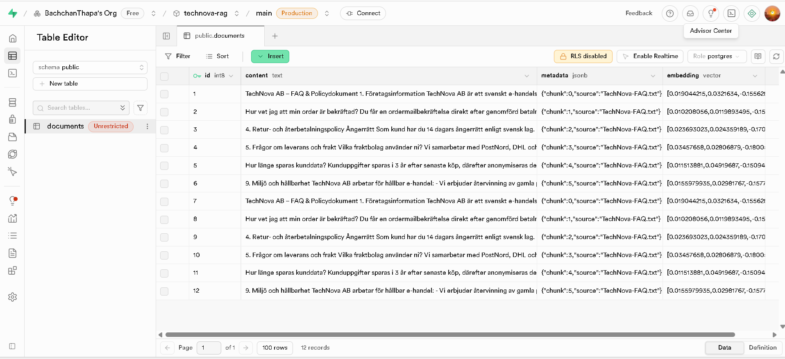

# technova-ai-support
# TechNova Chat 🗨️

Tools I used in this small full-stack project to build a **document-grounded chatbot** for TechNova AB.

- **Frontend:** Vite + React
- **Backend:** Express (in `packages/core/api`)
- **RAG / Search:** Supabase (`documents` table + `match_documents` RPC)
- **LLM:** Local Ollama (`llama3.1:8b`)
- **UI Components:** Local packages in `packages/base/*` (School-- basic style)

This explains **how the request travels** through the app and **where the files live** making it easier to follow the code.

---

## 🔁 How the chat works

1. User types a question in the **React chat UI**.
2. Frontend sends `POST /rag/chat` to the **Express API**.
3. API runs a **RAG pipeline**:
   - search TechNova FAQ in Supabase
   - check if the match is relevant
   - if yes → build prompt and ask Ollama
   - if no → send a polite fallback
4. API returns JSON: `{ answer, sources[] }`
5. React shows:
   - the assistant bubble
   - **`Source: TechNova FAQ`** (so we can prove it came from our document)

---
## 📸 Supabase table

Screenshot of the Supabase table where the TechNova FAQ/policy text is stored:



---

## 🧭 Request flow (RAG pipeline)

```text
React UI (chat)
   │
   └── POST /rag/chat  (through Vite proxy → http://localhost:8787)
         │
         └── Express route (packages/core/api/routes/chat.js)
               │
               └── Chat controller (packages/core/api/controller/chatController.js)
                     │
                     └── RAG chain (packages/core/api/lib/*)
                           │
                           ├── calls Supabase RPC "match_documents"
                           │       to search TechNova FAQ chunks
                           │
                           ├── evaluates relevance  (guardrail)
                           │
                           ├── if NO → build polite refusal
                           │   e.g. "Informationen saknas i dokumenten."
                           │
                           └── if YES →
                                   • build prompt = system + history + FAQ chunks
                                   • send to Ollama (llama3.1:8b)
                                   • get draft answer
                                   • attach sources (FAQ snippets)
                                         ↓
                              JSON back to React
